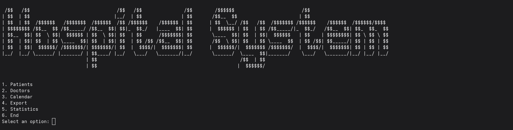
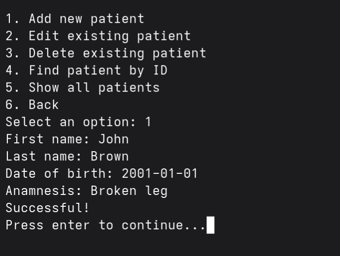
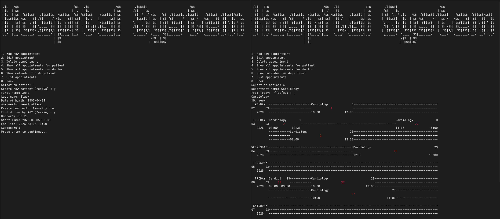

# User documentation 

# How to run

To build and run the program, you need:
* [Maven](https://maven.apache.org/download.cgi)
* JDK 25

To run the program you have to be in root directory of git repository. This can be achieved by running this commands: 
* using git: `git clone https://github.com/JakubOliver/HospitalSystem.git && cd HospitalSystem`
* from zip: `unzip HospitalSystem.zip && cd HospitalSystem`
  * Name of the zip file can vary.

Program can be run in terminal by using following command: `mvn install -pl :application -am -DskipTests && mvn exec:java -pl :application`.

For the best working program and user experience it is necessary to use **Java 25** and also is required to have installed **Maven** (to run the start command).

Note: It is also possible to run program directly inside IntelliJ, but it is not advised, because the IntelliJ terminal works differently than terminal in general and does not provide same options, for example running shell commands etc.

# Controls 

# GUI

Whole program can be controlled by user via graphical user interface (GUI).

## Main menu

First thing that the user sees when runs the program is main menu, where can user click to buttons which will take him to submenus with more specific options. Or exit via clicking on `End` button.

## Submenus

In each submenu use can interact with specific actions regarding the domain of submenu. For example in the `Patients submenu` can user `add`, `edit`, `delete`, `find` or `list` patients. 

## Operations 

# TUI

Whole program is controlled by user via terminal user interface (TUI). User is always prompted with the specific options and required actions, that help him to seamlessly control hospital system. 

## Main menu 

First thing that the user sees when runs the program is main menu, where can by inputting valid option open submenus with more specific options.

## Submenus menu 

By selecting first option can user open submenus such as menu for patients, doctors or appointments. In these menus is possible to add, edit, delete or view all entities (patients, doctors, appointments) based on the specific menu.

For example in the picture bellow you can example how to add new patient into hospital system. So the user is prompted to **Select an option** then inputs valid option **1**, after selecting option starts process of inputting data about new patient that will be added to the database, so the user inputs first name and last name of patient, date of birth and the issue (anamnesis) which troubles the patient.  

Last submenus are dedicated for exports and statistics of hospital system data. In these menus the user can create exports for the whole hospital system or can choose what data (patients, doctors or appointments) will be exported. 

After selecting the option will be created (if not already exists) directory exports in the root directory of the program and in this directory you can find files with exports in CSV format.

* `<date>-patients.csv` is export of patients
* `<date>-doctors.csv` is export of doctors
* `<date>-appointments.csv` is export of appointments

In the statistics submenu can user view basic statistics about hospital system such as number of patients and doctors, different averages, or statistics about most often diseases or specializations. 

## Types of inputs

While using the administrative system you will come a cross many types of inputs. Below you can see specification of each one:

* Text: this type of input you will be prompted while filling information about names, anamnesis etc. The only requirement for this input is that the provided text must be not empty. So if you wish to have patient with name "45afa#@" it is possible but not advisable.
* Integer: this type of input you will be prompted while filling information about identification number or selection options. The only requirements for this input is that the provided number is valid integer, so number such as 3.14 etc. are not valid.
* Date: this type of input you will be filling with information about mostly date of births for the measure with this entry is connected requirement, that the date have to be between date 1900-01-01 and present, and also the date have to be provided in correct YYYY-MM-DD format.
* DateTime: this type of input you will be prompted while filling information about times connected to the appointments. The requirement for this entry is that the time have to be between 2000-01-01 00:00 (inclusive) and 3000-01-01 00:00 (exclusive) and have correct format YYYY-MM-DD HH-MM or YYYY-MM-DDTHH-MM.

## How to exit

Every submenu can be exited (going back to main menu) by selecting options **Back**. And the program can be ended in the main menu by selecting option **End**. 

### Forceful exit

When you select wrong option and the administrative system already starts prompting you with inputs you can use key word **cancel** which will forcefully exit the inputting process.

# Tips and tricks

This section is dedicated for thing that could improve workflow of administration or maybe surprise user.

Firstly the whole administrative system is build with idea in mind that every running process and every function call only have source of truth for data and that is database. Therefore, it is easy and straightforward to used program with multiple instances at once. For example as show in the picture bellow this can be really useful while adding new appointment, because you can see at the same time calendar so it is easier to find empty space, where doctor does not have appointment.

When we talk about adding new appointments and more specifically when user selects the option to create new patient or doctor then it is important to know that, this process is independent of the appointment generation, because we did not want the user to prompt whole new patient and doctor again. So if you successfully create patient or doctor in this process but unfortunately the creation of appointment did not go through, for example because the appointment was in conflict with doctor's schedule then in second attempt you should select name or Id of the patient or doctor, because he or she is already in the system.